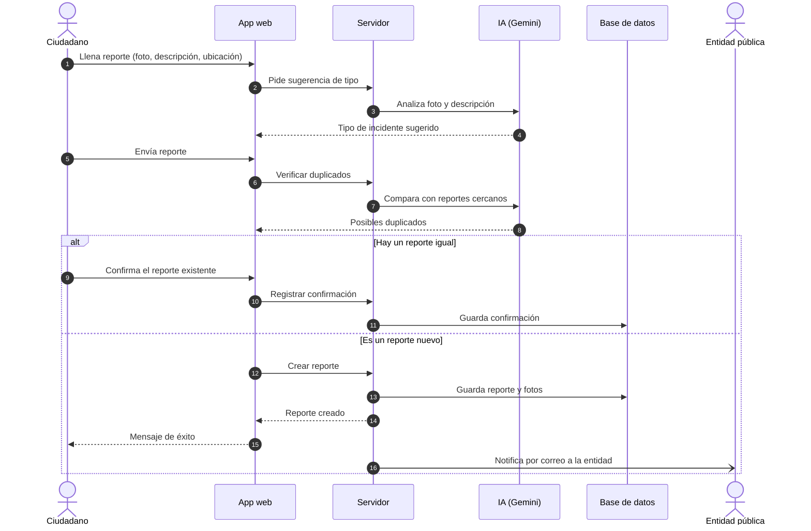

# Diagrama de secuencia (simplificado) — Crear un reporte

Versión para presentación. La versión detallada está en `diagrama-secuencia-crear-reporte.md`.

```mermaid
sequenceDiagram
    autonumber
    actor C as Ciudadano
    participant A as App web
    participant S as Servidor
    participant IA as IA (Gemini)
    participant DB as Base de datos
    actor E as Entidad pública

    C->>A: Llena reporte (foto, descripción, ubicación)
    A->>S: Pide sugerencia de tipo
    S->>IA: Analiza foto y descripción
    IA-->>A: Tipo de incidente sugerido

    C->>A: Envía reporte
    A->>S: Verificar duplicados
    S->>IA: Compara con reportes cercanos
    IA-->>A: Posibles duplicados

    alt Hay un reporte igual
        C->>A: Confirma el reporte existente
        A->>S: Registrar confirmación
        S->>DB: Guarda confirmación
    else Es un reporte nuevo
        A->>S: Crear reporte
        S->>DB: Guarda reporte y fotos
        S-->>A: Reporte creado
        A-->>C: Mensaje de éxito
        S-)E: Notifica por correo a la entidad
    end
```
